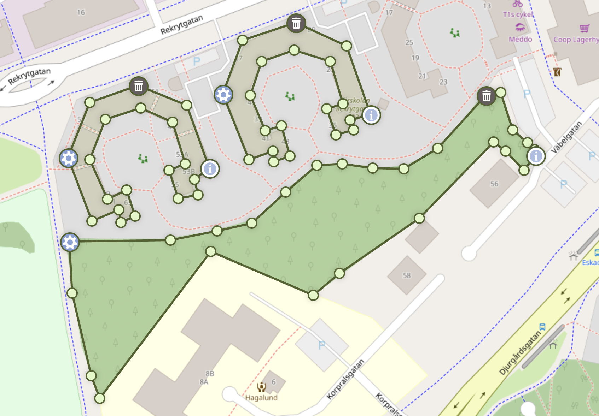
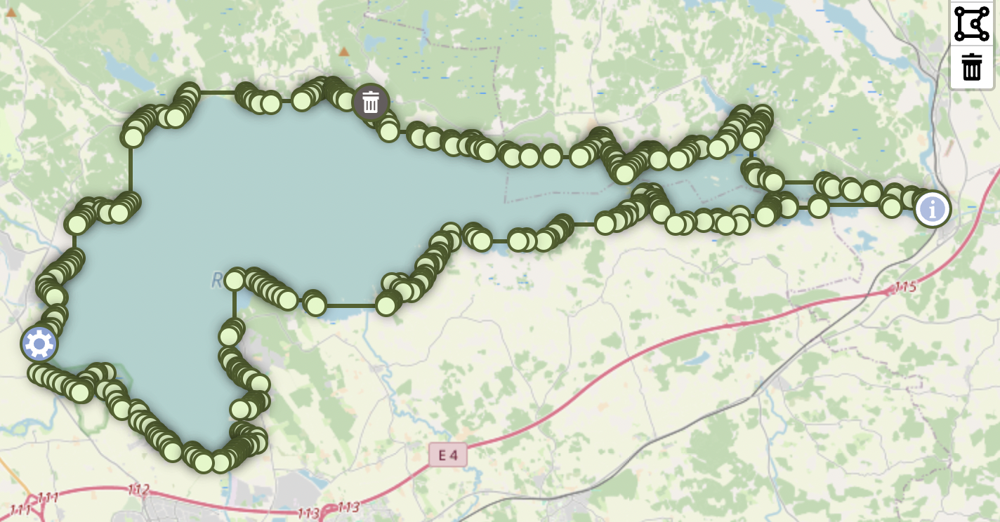
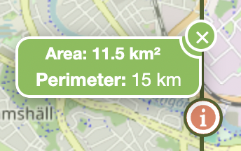
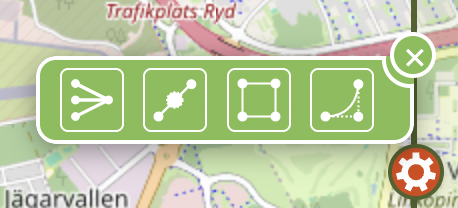
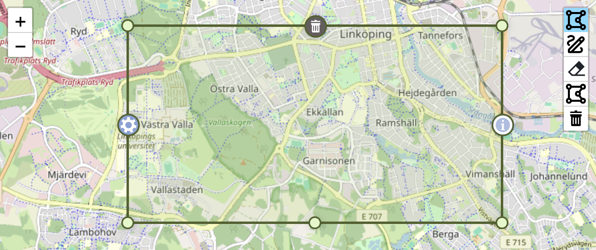

[](https://github.com/AndreasOlausson/leaflet-polydraw)

# Leaflet Polydraw

> **Advanced Leaflet plugin for interactive polygon drawing with point-to-point creation, smart merging, and comprehensive editing tools**

Leaflet Polydraw is a powerful, feature-rich plugin that transforms your Leaflet maps into interactive polygon drawing and editing environments. With intelligent merging, drag-and-drop functionality, and comprehensive editing tools, it's perfect for GIS applications, mapping tools, and spatial data collection.

[](https://badge.fury.io/js/leaflet-polydraw)
[](https://opensource.org/licenses/MIT)
[](https://www.typescriptlang.org/)

## Key Features

[](./docs/images/feature-overview.png)

- **Point-to-Point Drawing**: Precise polygon creation with click-by-click vertex placement
- **Smart Polygon Merging**: Automatic detection and merging of overlapping polygons (including C-to-O shape completion)
- **Drag & Drop**: Intuitive polygon repositioning with intelligent spatial interactions
- **Advanced Editing**: Drag vertices, add/remove points, and reshape polygons
- **Smart Markers**: Intelligent marker separation prevents overlapping on small polygons
- **Hole Support**: Create complex polygons with holes and nested shapes
- **Performance Optimized**: Efficient rendering and interaction handling
- **Well Tested**: Comprehensive test suite with 167+ passing tests
- **TypeScript Ready**: Full TypeScript support with type definitions

## Table of Contents

1. [Installation](#installation)
2. [Quick Start](#quick-start)
3. [Configuration](#configuration)
4. [Features](#features)
5. [API Reference](#api-reference)
6. [Markers](#markers)
7. [Events](#events)
8. [Examples](#examples)
9. [Browser Support](#browser-support)
10. [Contributing](#contributing)

## Installation

```bash
npm install leaflet-polydraw
```

### TypeScript Support

This package includes TypeScript declarations. If you encounter declaration issues, create a custom declaration file:

```typescript
// src/leaflet-polydraw.d.ts
declare module 'leaflet-polydraw' {
  import * as L from 'leaflet';

  export default class Polydraw extends L.Control {
    constructor(options?: L.ControlOptions & { config?: any });
    addTo(map: L.Map): this;
    configurate(config: any): void;
    addPredefinedPolygon(geographicBorders: L.LatLng[][][]): void;
    setDrawMode(mode: any): void;
    enablePolygonDraggingMode(enable?: boolean): void;
    // ... other methods
  }

  export enum DrawMode {
    Off = 0,
    Add = 1,
    Edit = 2,
    Subtract = 4,
    AppendMarker = 8,
    LoadPredefined = 16,
    PointToPoint = 32,
  }

  export enum MarkerPosition {
    SouthWest = 0,
    South = 1,
    SouthEast = 2,
    East = 3,
    NorthEast = 4,
    North = 5,
    NorthWest = 6,
    West = 7,
    Hole = 8,
  }
}
```

## Quick Start

### Basic Usage

```javascript
import * as L from 'leaflet';
import Polydraw from 'leaflet-polydraw';

// Create your map
const map = L.map('map').setView([59.911491, 10.757933], 16);
L.tileLayer('https://{s}.tile.openstreetmap.org/{z}/{x}/{y}.png').addTo(map);

// Add the PolyDraw control
const polyDrawControl = L.control
  .polydraw({
    position: 'topright',
  })
  .addTo(map);

// Listen for draw mode changes
polyDrawControl.onDrawModeChanged((mode) => {
  console.log('Draw mode changed to:', mode);
});
```

### Advanced Configuration

```javascript
import Polydraw, { DrawMode, MarkerPosition } from 'leaflet-polydraw';

const polyDrawControl = L.control
  .polydraw({
    position: 'topright',
    config: {
      touchSupport: true,
      mergePolygons: true,
      modes: {
        dragPolygons: true,
        attachElbow: true,
        dragElbow: true,
      },
      dragPolygons: {
        autoMergeOnIntersect: true,
        autoHoleOnContained: true,
        markerBehavior: 'hide',
      },
      markers: {
        deleteMarker: true,
        infoMarker: true,
        menuMarker: true,
        markerDeleteIcon: {
          position: MarkerPosition.NorthWest,
        },
        markerInfoIcon: {
          position: MarkerPosition.NorthEast,
          useMetrics: true,
        },
      },
      polygonOptions: {
        color: '#ff0000',
        fillColor: '#ff0000',
        fillOpacity: 0.3,
      },
    },
  })
  .addTo(map);
```

## Configuration

### Default Configuration

```javascript
{
  "touchSupport": true,
  "mergePolygons": true,
  "kinks": false,
  "modes": {
    "draw": true,
    "subtract": true,
    "deleteAll": true,
    "p2p": true,
    "attachElbow": true,
    "dragElbow": true,
    "dragPolygons": true,
    "edgeDeletion": true
  },
  "dragPolygons": {
    "realTimeUpdate": false,
    "showDragHandle": false,
    "opacity": 0.7,
    "dragCursor": "move",
    "hoverCursor": "grab",
    "markerBehavior": "hide",
    "markerAnimationDuration": 200,
    "autoMergeOnIntersect": true,
    "autoHoleOnContained": false,
    "dragInteractionBehavior": "auto",
    "modifierSubtract": {
      "enabled": true,
      "keys": {
        "windows": "ctrlKey",
        "mac": "metaKey",
        "linux": "ctrlKey"
      },
      "subtractColor": "#D9460F",
      "hideMarkersOnDrag": true
    }
  },
  "edgeDeletion": {
    "enabled": true,
    "modifierKey": "auto",
    "hoverColor": "#D9460F",
    "confirmDeletion": false,
    "minVertices": 3
  },
  "markers": {
    "deleteMarker": true,
    "infoMarker": true,
    "menuMarker": true,
    "coordsTitle": true,
    "zIndexOffset": 0,
    "markerIcon": {
      "styleClasses": ["polygon-marker"],
      "zIndexOffset": null
    },
    "holeIcon": {
      "styleClasses": ["polygon-marker", "hole"],
      "zIndexOffset": null
    },
    "markerInfoIcon": {
      "position": 3,
      "showArea": true,
      "showPerimeter": true,
      "useMetrics": true,
      "usePerimeterMinValue": false,
      "areaLabel": "Area",
      "perimeterLabel": "Perimeter",
      "values": {
        "min": {
          "metric": "50",
          "imperial": "100"
        },
        "unknown": {
          "metric": "-",
          "imperial": "-"
        }
      },
      "units": {
        "unknownUnit": "",
        "metric": {
          "onlyMetrics": true,
          "perimeter": {
            "m": "m",
            "km": "km"
          },
          "area": {
            "m2": "m²",
            "km2": "km²",
            "daa": "daa",
            "ha": "ha"
          }
        },
        "imperial": {
          "perimeter": {
            "feet": "ft",
            "yards": "yd",
            "miles": "mi"
          },
          "area": {
            "feet2": "ft²",
            "yards2": "yd²",
            "acres": "ac",
            "miles2": "mi²"
          }
        }
      },
      "styleClasses": ["polygon-marker", "info"],
      "zIndexOffset": 10000
    },
    "markerMenuIcon": {
      "position": 7,
      "styleClasses": ["polygon-marker", "menu"],
      "zIndexOffset": 10000
    },
    "markerDeleteIcon": {
      "position": 5,
      "styleClasses": ["polygon-marker", "delete"],
      "zIndexOffset": 10000
    },
    "visualOptimization": {
      "sharpAngleThreshold": 30,
      "thresholdBoundingBox": 0.05,
      "thresholdDistance": 0.05,
      "useDistance": true,
      "useBoundingBox": false,
      "useAngles": false
    }
  },
  "polyLineOptions": {
    "color": "#50622b",
    "opacity": 1,
    "smoothFactor": 0,
    "noClip": true,
    "clickable": false,
    "weight": 2
  },
  "subtractLineOptions": {
    "color": "#50622b",
    "opacity": 1,
    "smoothFactor": 0,
    "noClip": true,
    "clickable": false,
    "weight": 2
  },
  "polygonOptions": {
    "smoothFactor": 0.3,
    "color": "#50622b",
    "fillColor": "#b4cd8a",
    "noClip": true
  },
  "holeOptions": {
    "color": "#aa0000",
    "fillColor": "#ffcccc",
    "weight": 2,
    "opacity": 1,
    "fillOpacity": 0.5
  },
  "polygonCreation": {
    "method": "concaveman",
    "simplification": {
      "mode": "simple",
      "tolerance": 0.0001,
      "highQuality": false
    }
  },
  "simplification": {
    "simplifyTolerance": {
      "tolerance": 0.0001,
      "highQuality": false,
      "mutate": false
    },
    "dynamicMode": {
      "fractionGuard": 0.9,
      "multipiler": 2
    }
  },
  "boundingBox": {
    "addMidPointMarkers": true
  },
  "bezier": {
    "resolution": 10000,
    "sharpness": 0.75
  }
}
```

### Configuration Options

| Key                                                                | Type    | Default                        | Description                                               |
| ------------------------------------------------------------------ | ------- | ------------------------------ | --------------------------------------------------------- |
| **touchSupport**                                                   | boolean | `true`                         | Enable touch support for mobile devices                   |
| **mergePolygons**                                                  | boolean | `true`                         | Auto-merge polygons during drawing when they intersect    |
| **kinks**                                                          | boolean | `false`                        | Allow self-intersecting polygons                          |
| **modes**                                                          | object  |                                | Feature toggles                                           |
| &nbsp;&nbsp;draw                                                   | boolean | `true`                         | Enable draw mode button                                   |
| &nbsp;&nbsp;subtract                                               | boolean | `true`                         | Enable subtract mode button                               |
| &nbsp;&nbsp;deleteAll                                              | boolean | `true`                         | Enable delete all button                                  |
| &nbsp;&nbsp;p2p                                                    | boolean | `true`                         | Enable point-to-point drawing mode                        |
| &nbsp;&nbsp;attachElbow                                            | boolean | `true`                         | Enable clicking on edges to add vertices                  |
| &nbsp;&nbsp;dragElbow                                              | boolean | `true`                         | Enable dragging vertices                                  |
| &nbsp;&nbsp;dragPolygons                                           | boolean | `true`                         | Enable dragging entire polygons                           |
| &nbsp;&nbsp;edgeDeletion                                           | boolean | `true`                         | Enable edge deletion with modifier keys                   |
| **dragPolygons**                                                   | object  |                                | Polygon dragging configuration                            |
| &nbsp;&nbsp;realTimeUpdate                                         | boolean | `false`                        | Update polygon position in real-time during drag          |
| &nbsp;&nbsp;showDragHandle                                         | boolean | `false`                        | Show visual drag handle on polygons                       |
| &nbsp;&nbsp;opacity                                                | number  | `0.7`                          | Polygon opacity during drag (0-1)                         |
| &nbsp;&nbsp;dragCursor                                             | string  | `"move"`                       | Cursor during active dragging                             |
| &nbsp;&nbsp;hoverCursor                                            | string  | `"grab"`                       | Cursor when hovering over draggable polygons              |
| &nbsp;&nbsp;markerBehavior                                         | string  | `"hide"`                       | Marker behavior during drag: `"hide"`, `"show"`, `"fade"` |
| &nbsp;&nbsp;markerAnimationDuration                                | number  | `200`                          | Duration of marker animations in milliseconds             |
| &nbsp;&nbsp;autoMergeOnIntersect                                   | boolean | `true`                         | Auto-merge when dragging polygons together                |
| &nbsp;&nbsp;autoHoleOnContained                                    | boolean | `false`                        | Create holes when dragging inside polygons                |
| &nbsp;&nbsp;dragInteractionBehavior                                | string  | `"auto"`                       | How drag interactions are handled                         |
| &nbsp;&nbsp;**modifierSubtract**                                   | object  |                                | Modifier key subtract configuration                       |
| &nbsp;&nbsp;&nbsp;&nbsp;enabled                                    | boolean | `true`                         | Enable modifier key subtract mode                         |
| &nbsp;&nbsp;&nbsp;&nbsp;**keys**                                   | object  |                                | Platform-specific modifier keys                           |
| &nbsp;&nbsp;&nbsp;&nbsp;&nbsp;&nbsp;windows                        | string  | `"ctrlKey"`                    | Windows modifier key                                      |
| &nbsp;&nbsp;&nbsp;&nbsp;&nbsp;&nbsp;mac                            | string  | `"metaKey"`                    | Mac modifier key                                          |
| &nbsp;&nbsp;&nbsp;&nbsp;&nbsp;&nbsp;linux                          | string  | `"ctrlKey"`                    | Linux modifier key                                        |
| &nbsp;&nbsp;&nbsp;&nbsp;subtractColor                              | string  | `"#D9460F"`                    | Color for subtract mode visualization                     |
| &nbsp;&nbsp;&nbsp;&nbsp;hideMarkersOnDrag                          | boolean | `true`                         | Hide markers during subtract drag                         |
| **edgeDeletion**                                                   | object  |                                | Edge deletion configuration                               |
| &nbsp;&nbsp;enabled                                                | boolean | `true`                         | Enable edge deletion functionality                        |
| &nbsp;&nbsp;modifierKey                                            | string  | `"auto"`                       | Modifier key: `"ctrl"`, `"cmd"`, `"auto"`                 |
| &nbsp;&nbsp;hoverColor                                             | string  | `"#D9460F"`                    | Color when hovering over deletable edges                  |
| &nbsp;&nbsp;confirmDeletion                                        | boolean | `false`                        | Require confirmation before deleting                      |
| &nbsp;&nbsp;minVertices                                            | number  | `3`                            | Minimum vertices required after deletion                  |
| **markers**                                                        | object  |                                | Marker configuration                                      |
| &nbsp;&nbsp;deleteMarker                                           | boolean | `true`                         | Show delete marker                                        |
| &nbsp;&nbsp;infoMarker                                             | boolean | `true`                         | Show info marker with area/perimeter                      |
| &nbsp;&nbsp;menuMarker                                             | boolean | `true`                         | Show menu marker with operations                          |
| &nbsp;&nbsp;coordsTitle                                            | boolean | `true`                         | Show coordinate tooltips on markers                       |
| &nbsp;&nbsp;zIndexOffset                                           | number  | `0`                            | Global z-index offset for markers                         |
| &nbsp;&nbsp;**markerIcon**                                         | object  |                                | Standard marker configuration                             |
| &nbsp;&nbsp;&nbsp;&nbsp;styleClasses                               | array   | `["polygon-marker"]`           | CSS classes for standard markers                          |
| &nbsp;&nbsp;&nbsp;&nbsp;zIndexOffset                               | number  | `null`                         | Z-index offset override                                   |
| &nbsp;&nbsp;**holeIcon**                                           | object  |                                | Hole marker configuration                                 |
| &nbsp;&nbsp;&nbsp;&nbsp;styleClasses                               | array   | `["polygon-marker", "hole"]`   | CSS classes for hole markers                              |
| &nbsp;&nbsp;&nbsp;&nbsp;zIndexOffset                               | number  | `null`                         | Z-index offset override                                   |
| &nbsp;&nbsp;**markerInfoIcon**                                     | object  |                                | Info marker configuration                                 |
| &nbsp;&nbsp;&nbsp;&nbsp;position                                   | number  | `3`                            | Marker position (see MarkerPosition enum)                 |
| &nbsp;&nbsp;&nbsp;&nbsp;showArea                                   | boolean | `true`                         | Display area information                                  |
| &nbsp;&nbsp;&nbsp;&nbsp;showPerimeter                              | boolean | `true`                         | Display perimeter information                             |
| &nbsp;&nbsp;&nbsp;&nbsp;useMetrics                                 | boolean | `true`                         | Use metric units                                          |
| &nbsp;&nbsp;&nbsp;&nbsp;usePerimeterMinValue                       | boolean | `false`                        | Use minimum value for small perimeters                    |
| &nbsp;&nbsp;&nbsp;&nbsp;areaLabel                                  | string  | `"Area"`                       | Label for area display                                    |
| &nbsp;&nbsp;&nbsp;&nbsp;perimeterLabel                             | string  | `"Perimeter"`                  | Label for perimeter display                               |
| &nbsp;&nbsp;&nbsp;&nbsp;**values**                                 | object  |                                | Default values configuration                              |
| &nbsp;&nbsp;&nbsp;&nbsp;&nbsp;&nbsp;**min**                        | object  |                                | Minimum value settings                                    |
| &nbsp;&nbsp;&nbsp;&nbsp;&nbsp;&nbsp;&nbsp;&nbsp;metric             | string  | `"50"`                         | Minimum metric value                                      |
| &nbsp;&nbsp;&nbsp;&nbsp;&nbsp;&nbsp;&nbsp;&nbsp;imperial           | string  | `"100"`                        | Minimum imperial value                                    |
| &nbsp;&nbsp;&nbsp;&nbsp;&nbsp;&nbsp;**unknown**                    | object  |                                | Unknown value settings                                    |
| &nbsp;&nbsp;&nbsp;&nbsp;&nbsp;&nbsp;&nbsp;&nbsp;metric             | string  | `"-"`                          | Unknown metric placeholder                                |
| &nbsp;&nbsp;&nbsp;&nbsp;&nbsp;&nbsp;&nbsp;&nbsp;imperial           | string  | `"-"`                          | Unknown imperial placeholder                              |
| &nbsp;&nbsp;&nbsp;&nbsp;**units**                                  | object  |                                | Unit configuration                                        |
| &nbsp;&nbsp;&nbsp;&nbsp;&nbsp;&nbsp;unknownUnit                    | string  | `""`                           | Unknown unit placeholder                                  |
| &nbsp;&nbsp;&nbsp;&nbsp;&nbsp;&nbsp;**metric**                     | object  |                                | Metric units                                              |
| &nbsp;&nbsp;&nbsp;&nbsp;&nbsp;&nbsp;&nbsp;&nbsp;onlyMetrics        | boolean | `true`                         | Use only m² and km² for area                              |
| &nbsp;&nbsp;&nbsp;&nbsp;&nbsp;&nbsp;&nbsp;&nbsp;**perimeter**      | object  |                                | Perimeter units                                           |
| &nbsp;&nbsp;&nbsp;&nbsp;&nbsp;&nbsp;&nbsp;&nbsp;&nbsp;&nbsp;m      | string  | `"m"`                          | Meter unit                                                |
| &nbsp;&nbsp;&nbsp;&nbsp;&nbsp;&nbsp;&nbsp;&nbsp;&nbsp;&nbsp;km     | string  | `"km"`                         | Kilometer unit                                            |
| &nbsp;&nbsp;&nbsp;&nbsp;&nbsp;&nbsp;&nbsp;&nbsp;**area**           | object  |                                | Area units                                                |
| &nbsp;&nbsp;&nbsp;&nbsp;&nbsp;&nbsp;&nbsp;&nbsp;&nbsp;&nbsp;m2     | string  | `"m²"`                         | Square meter unit                                         |
| &nbsp;&nbsp;&nbsp;&nbsp;&nbsp;&nbsp;&nbsp;&nbsp;&nbsp;&nbsp;km2    | string  | `"km²"`                        | Square kilometer unit                                     |
| &nbsp;&nbsp;&nbsp;&nbsp;&nbsp;&nbsp;&nbsp;&nbsp;&nbsp;&nbsp;daa    | string  | `"daa"`                        | Decare unit                                               |
| &nbsp;&nbsp;&nbsp;&nbsp;&nbsp;&nbsp;&nbsp;&nbsp;&nbsp;&nbsp;ha     | string  | `"ha"`                         | Hectare unit                                              |
| &nbsp;&nbsp;&nbsp;&nbsp;&nbsp;&nbsp;**imperial**                   | object  |                                | Imperial units                                            |
| &nbsp;&nbsp;&nbsp;&nbsp;&nbsp;&nbsp;&nbsp;&nbsp;**perimeter**      | object  |                                | Perimeter units                                           |
| &nbsp;&nbsp;&nbsp;&nbsp;&nbsp;&nbsp;&nbsp;&nbsp;&nbsp;&nbsp;feet   | string  | `"ft"`                         | Feet unit                                                 |
| &nbsp;&nbsp;&nbsp;&nbsp;&nbsp;&nbsp;&nbsp;&nbsp;&nbsp;&nbsp;yards  | string  | `"yd"`                         | Yards unit                                                |
| &nbsp;&nbsp;&nbsp;&nbsp;&nbsp;&nbsp;&nbsp;&nbsp;&nbsp;&nbsp;miles  | string  | `"mi"`                         | Miles unit                                                |
| &nbsp;&nbsp;&nbsp;&nbsp;&nbsp;&nbsp;&nbsp;&nbsp;**area**           | object  |                                | Area units                                                |
| &nbsp;&nbsp;&nbsp;&nbsp;&nbsp;&nbsp;&nbsp;&nbsp;&nbsp;&nbsp;feet2  | string  | `"ft²"`                        | Square feet unit                                          |
| &nbsp;&nbsp;&nbsp;&nbsp;&nbsp;&nbsp;&nbsp;&nbsp;&nbsp;&nbsp;yards2 | string  | `"yd²"`                        | Square yards unit                                         |
| &nbsp;&nbsp;&nbsp;&nbsp;&nbsp;&nbsp;&nbsp;&nbsp;&nbsp;&nbsp;acres  | string  | `"ac"`                         | Acres unit                                                |
| &nbsp;&nbsp;&nbsp;&nbsp;&nbsp;&nbsp;&nbsp;&nbsp;&nbsp;&nbsp;miles2 | string  | `"mi²"`                        | Square miles unit                                         |
| &nbsp;&nbsp;&nbsp;&nbsp;styleClasses                               | array   | `["polygon-marker", "info"]`   | CSS classes for info marker                               |
| &nbsp;&nbsp;&nbsp;&nbsp;zIndexOffset                               | number  | `10000`                        | Z-index offset for info marker                            |
| &nbsp;&nbsp;**markerMenuIcon**                                     | object  |                                | Menu marker configuration                                 |
| &nbsp;&nbsp;&nbsp;&nbsp;position                                   | number  | `7`                            | Marker position (see MarkerPosition enum)                 |
| &nbsp;&nbsp;&nbsp;&nbsp;styleClasses                               | array   | `["polygon-marker", "menu"]`   | CSS classes for menu marker                               |
| &nbsp;&nbsp;&nbsp;&nbsp;zIndexOffset                               | number  | `10000`                        | Z-index offset for menu marker                            |
| &nbsp;&nbsp;**markerDeleteIcon**                                   | object  |                                | Delete marker configuration                               |
| &nbsp;&nbsp;&nbsp;&nbsp;position                                   | number  | `5`                            | Marker position (see MarkerPosition enum)                 |
| &nbsp;&nbsp;&nbsp;&nbsp;styleClasses                               | array   | `["polygon-marker", "delete"]` | CSS classes for delete marker                             |
| &nbsp;&nbsp;&nbsp;&nbsp;zIndexOffset                               | number  | `10000`                        | Z-index offset for delete marker                          |
| &nbsp;&nbsp;**visualOptimization**                                 | object  |                                | Visual optimization settings                              |
| &nbsp;&nbsp;&nbsp;&nbsp;sharpAngleThreshold                        | number  | `30`                           | Angle threshold for optimization                          |
| &nbsp;&nbsp;&nbsp;&nbsp;thresholdBoundingBox                       | number  | `0.05`                         | Bounding box threshold                                    |
| &nbsp;&nbsp;&nbsp;&nbsp;thresholdDistance                          | number  | `0.05`                         | Distance threshold                                        |
| &nbsp;&nbsp;&nbsp;&nbsp;useDistance                                | boolean | `true`                         | Use distance-based optimization                           |
| &nbsp;&nbsp;&nbsp;&nbsp;useBoundingBox                             | boolean | `false`                        | Use bounding box optimization                             |
| &nbsp;&nbsp;&nbsp;&nbsp;useAngles                                  | boolean | `false`                        | Use angle-based optimization                              |
| **polyLineOptions**                                                | object  |                                | Polyline styling options                                  |
| &nbsp;&nbsp;color                                                  | string  | `"#50622b"`                    | Polyline color                                            |
| &nbsp;&nbsp;opacity                                                | number  | `1`                            | Polyline opacity                                          |
| &nbsp;&nbsp;smoothFactor                                           | number  | `0`                            | Polyline smoothing factor                                 |
| &nbsp;&nbsp;noClip                                                 | boolean | `true`                         | Disable polyline clipping                                 |
| &nbsp;&nbsp;clickable                                              | boolean | `false`                        | Make polyline clickable                                   |
| &nbsp;&nbsp;weight                                                 | number  | `2`                            | Polyline weight in pixels                                 |
| **subtractLineOptions**                                            | object  |                                | Subtract mode polyline styling                            |
| &nbsp;&nbsp;color                                                  | string  | `"#50622b"`                    | Subtract polyline color                                   |
| &nbsp;&nbsp;opacity                                                | number  | `1`                            | Subtract polyline opacity                                 |
| &nbsp;&nbsp;smoothFactor                                           | number  | `0`                            | Subtract polyline smoothing                               |
| &nbsp;&nbsp;noClip                                                 | boolean | `true`                         | Disable subtract polyline clipping                        |
| &nbsp;&nbsp;clickable                                              | boolean | `false`                        | Make subtract polyline clickable                          |
| &nbsp;&nbsp;weight                                                 | number  | `2`                            | Subtract polyline weight                                  |
| **polygonOptions**                                                 | object  |                                | Polygon styling options                                   |
| &nbsp;&nbsp;smoothFactor                                           | number  | `0.3`                          | Polygon smoothing factor                                  |
| &nbsp;&nbsp;color                                                  | string  | `"#50622b"`                    | Polygon border color                                      |
| &nbsp;&nbsp;fillColor                                              | string  | `"#b4cd8a"`                    | Polygon fill color                                        |
| &nbsp;&nbsp;noClip                                                 | boolean | `true`                         | Disable polygon clipping                                  |
| **holeOptions**                                                    | object  |                                | Hole styling options                                      |
| &nbsp;&nbsp;color                                                  | string  | `"#aa0000"`                    | Hole border color                                         |
| &nbsp;&nbsp;fillColor                                              | string  | `"#ffcccc"`                    | Hole fill color                                           |
| &nbsp;&nbsp;weight                                                 | number  | `2`                            | Hole border weight                                        |
| &nbsp;&nbsp;opacity                                                | number  | `1`                            | Hole border opacity                                       |
| &nbsp;&nbsp;fillOpacity                                            | number  | `0.5`                          | Hole fill opacity                                         |
| **polygonCreation**                                                | object  |                                | Polygon creation settings                                 |
| &nbsp;&nbsp;method                                                 | string  | `"concaveman"`                 | Creation method                                           |
| &nbsp;&nbsp;**simplification**                                     | object  |                                | Creation simplification                                   |
| &nbsp;&nbsp;&nbsp;&nbsp;mode                                       | string  | `"simple"`                     | Simplification mode                                       |
| &nbsp;&nbsp;&nbsp;&nbsp;tolerance                                  | number  | `0.0001`                       | Simplification tolerance                                  |
| &nbsp;&nbsp;&nbsp;&nbsp;highQuality                                | boolean | `false`                        | High quality simplification                               |
| **simplification**                                                 | object  |                                | General simplification settings                           |
| &nbsp;&nbsp;**simplifyTolerance**                                  | object  |                                | Tolerance settings                                        |
| &nbsp;&nbsp;&nbsp;&nbsp;tolerance                                  | number  | `0.0001`                       | Simplification tolerance                                  |
| &nbsp;&nbsp;&nbsp;&nbsp;highQuality                                | boolean | `false`                        | High quality mode                                         |
| &nbsp;&nbsp;&nbsp;&nbsp;mutate                                     | boolean | `false`                        | Allow input mutation                                      |
| &nbsp;&nbsp;**dynamicMode**                                        | object  |                                | Dynamic simplification                                    |
| &nbsp;&nbsp;&nbsp;&nbsp;fractionGuard                              | number  | `0.9`                          | Fraction guard value                                      |
| &nbsp;&nbsp;&nbsp;&nbsp;multipiler                                 | number  | `2`                            | Tolerance multiplier                                      |
| **boundingBox**                                                    | object  |                                | Bounding box settings                                     |
| &nbsp;&nbsp;addMidPointMarkers                                     | boolean | `true`                         | Add midpoint markers to bounding box                      |
| **bezier**                                                         | object  |                                | Bezier curve settings                                     |
| &nbsp;&nbsp;resolution                                             | number  | `10000`                        | Bezier curve resolution                                   |
| &nbsp;&nbsp;sharpness                                              | number  | `0.75`                         | Bezier curve sharpness                                    |

### External Configuration

Load configuration from an external JSON file:

```javascript
const polyDrawControl = L.control.polydraw({
  configPath: 'path/to/your/polydraw.config.json',
});
```

## Features

### Point-to-Point Drawing

[](./docs/images/point-to-point-drawing.gif)

Create precise polygons by clicking to place each vertex. Perfect for:

- Accurate boundary mapping
- Property delineation
- Custom shape creation

### Smart Polygon Merging

[](./docs/images/smart-merging.gif)

The plugin features **two independent merge systems**:

#### 1. Drawing Merge (`mergePolygons`)

- **When**: During polygon creation
- **Purpose**: Automatically merge new polygons with existing intersecting ones
- **Use case**: Streamlined drawing workflow

#### 2. Drag Merge (`autoMergeOnIntersect`)

- **When**: During polygon dragging
- **Purpose**: Merge polygons when dragged together
- **Use case**: Interactive editing and combining

### Drag & Drop Functionality

[](./docs/images/drag-drop.gif)

**Drag-to-Merge**: Drag polygons together to automatically merge them

**Drag-to-Hole**: Drag a polygon completely inside another to create a hole

**Repositioning**: Drag to empty areas to simply reposition polygons

### Advanced Editing Tools

[](./docs/images/editing-tools.png)

Access powerful operations through the menu marker:

- **Simplify**: Reduce polygon complexity using Douglas-Peucker algorithm
- **Bounding Box**: Convert to rectangular bounds
- **Double Elbows**: Add intermediate vertices for higher resolution
- **Bezier Curves**: Apply smooth curve interpolation (alpha)

### Smart Marker System

[](./docs/images/smart-markers.png)

Intelligent marker positioning prevents overlapping on small polygons:

- **Automatic separation**: Detects potential overlaps and redistributes markers
- **Priority-based**: Resolves conflicts using info → delete → menu priority
- **Smooth animations**: Markers fade during drag operations

## API Reference

### Methods

#### `setDrawMode(mode: DrawMode)`

Set the current drawing mode.

```javascript
import { DrawMode } from 'leaflet-polydraw';
polyDrawControl.setDrawMode(DrawMode.Add);
```

#### `enablePolygonDraggingMode(enable: boolean)`

Enable or disable polygon dragging.

```javascript
polyDrawControl.enablePolygonDraggingMode(true);
```

#### `addPredefinedPolygon(geographicBorders: L.LatLng[][][])`

Programmatically add polygons to the map.

```javascript
const polygon = [
  [
    [
      { lat: 59.903, lng: 10.724 },
      { lat: 59.908, lng: 10.728 },
      { lat: 59.91, lng: 10.72 },
      { lat: 59.903, lng: 10.724 },
    ],
  ],
];
polyDrawControl.addPredefinedPolygon(polygon);
```

#### `configurate(config: any)`

Update configuration after initialization.

```javascript
polyDrawControl.configurate({
  dragPolygons: {
    autoMergeOnIntersect: false,
    hoverCursor: 'pointer',
  },
  polygonOptions: {
    color: '#ff0000',
  },
});
```

### Enums

#### DrawMode

```javascript
enum DrawMode {
    Off = 0,        // Drawing disabled, dragging enabled
    Add = 1,        // Add new polygons
    Edit = 2,       // Edit existing polygons
    Subtract = 4    // Create holes in polygons
}
```

#### MarkerPosition

```javascript
enum MarkerPosition {
    SouthWest = 0,
    South = 1,
    SouthEast = 2,
    East = 3,
    NorthEast = 4,
    North = 5,
    NorthWest = 6,
    West = 7
}
```

## Markers

[](./docs/images/marker-types.png)

### Delete Marker (Default: North West)

- **Purpose**: Delete the entire polygon
- **Icon**: Trash/delete icon
- **Behavior**: Fades during drag operations

### Info Marker (Default: North East)

- **Purpose**: Display polygon metrics
- **Features**: Area, perimeter, metric/imperial units
- **Popup**: Shows detailed measurements

[](./docs/images/info-marker-popup.png)

### Menu Marker (Default: West)

- **Purpose**: Access polygon operations
- **Operations**: Simplify, bounding box, double elbows, bezier
- **Popup**: Interactive operation menu

[](./docs/images/menu-marker-popup.png)

### Marker Positioning

Customize marker positions using the `MarkerPosition` enum:

```javascript
const polyDrawControl = L.control.polydraw({
  config: {
    markers: {
      markerDeleteIcon: {
        position: MarkerPosition.North,
        styleClasses: ['custom-delete-marker'],
      },
      markerInfoIcon: {
        position: MarkerPosition.East,
        useMetrics: true,
        areaLabel: 'Area',
        perimeterLabel: 'Perimeter',
      },
      markerMenuIcon: {
        position: MarkerPosition.West,
        styleClasses: ['custom-menu-marker'],
      },
    },
  },
});
```

[](./docs/images/marker-positions.png)

## Events

### Draw Mode Events

```javascript
polyDrawControl.onDrawModeChanged((mode) => {
  console.log('Draw mode changed to:', mode);

  if (mode === DrawMode.Off) {
    console.log('Polygon dragging is now available');
  }
});
```

### Polygon Drag Events

```javascript
// Drag start
map.on('polygon:dragstart', (e) => {
  console.log('Drag started:', e.polygon);
  console.log('Feature group:', e.featureGroup);
  console.log('Original coordinates:', e.originalLatLngs);
});

// Drag end
map.on('polygon:dragend', (e) => {
  console.log('Drag ended:', e.polygon);
  console.log('Old position:', e.oldPosition);
  console.log('New position:', e.newPosition);
});

// Real-time drag (if enabled)
map.on('polygon:drag', (e) => {
  console.log('Dragging:', e.polygon);
});
```

## Examples

### Basic Drawing Application

```javascript
import * as L from 'leaflet';
import Polydraw, { DrawMode } from 'leaflet-polydraw';

class DrawingApp {
  constructor() {
    this.initMap();
    this.initControls();
  }

  initMap() {
    this.map = L.map('map').setView([59.911491, 10.757933], 16);
    L.tileLayer('https://{s}.tile.openstreetmap.org/{z}/{x}/{y}.png').addTo(this.map);

    this.polyDrawControl = L.control
      .polydraw({
        position: 'topright',
        config: {
          mergePolygons: true,
          dragPolygons: {
            autoMergeOnIntersect: true,
            autoHoleOnContained: true,
          },
        },
      })
      .addTo(this.map);
  }

  initControls() {
    // Add drawing mode buttons
    document.getElementById('draw-btn').onclick = () => {
      this.polyDrawControl.setDrawMode(DrawMode.Add);
    };

    document.getElementById('subtract-btn').onclick = () => {
      this.polyDrawControl.setDrawMode(DrawMode.Subtract);
    };

    document.getElementById('drag-btn').onclick = () => {
      this.polyDrawControl.setDrawMode(DrawMode.Off);
      this.polyDrawControl.enablePolygonDraggingMode(true);
    };
  }
}

new DrawingApp();
```

### GIS Data Collection

```javascript
import Polydraw, { MarkerPosition } from 'leaflet-polydraw';

const gisCollector = L.control
  .polydraw({
    config: {
      markers: {
        infoMarker: true,
        markerInfoIcon: {
          position: MarkerPosition.NorthEast,
          useMetrics: true,
          showArea: true,
          showPerimeter: true,
          areaLabel: 'Area (m²)',
          perimeterLabel: 'Perimeter (m)',
        },
      },
      polygonOptions: {
        color: '#2196F3',
        fillColor: '#2196F3',
        fillOpacity: 0.3,
        weight: 2,
      },
    },
  })
  .addTo(map);

// Export collected data
function exportPolygons() {
  const polygons = gisCollector.getAllPolygons();
  const geojson = {
    type: 'FeatureCollection',
    features: polygons.map((polygon) => ({
      type: 'Feature',
      geometry: {
        type: 'Polygon',
        coordinates: polygon.getLatLngs(),
      },
      properties: {
        area: L.GeometryUtil.geodesicArea(polygon.getLatLngs()[0]),
        timestamp: new Date().toISOString(),
      },
    })),
  };

  console.log('Exported GeoJSON:', geojson);
}
```

### Property Mapping Tool

```javascript
const propertyMapper = L.control
  .polydraw({
    config: {
      mergePolygons: false, // Keep properties separate
      dragPolygons: {
        autoMergeOnIntersect: false,
        autoHoleOnContained: false, // Prevent accidental holes
      },
      markers: {
        menuMarker: true,
        markerMenuIcon: {
          position: MarkerPosition.North,
        },
      },
      polygonOptions: {
        color: '#4CAF50',
        fillColor: '#4CAF50',
        fillOpacity: 0.2,
        weight: 3,
      },
    },
  })
  .addTo(map);

// Add property metadata
map.on('polygon:created', (e) => {
  const propertyId = prompt('Enter Property ID:');
  const owner = prompt('Enter Owner Name:');

  e.polygon.propertyData = {
    id: propertyId,
    owner: owner,
    area: L.GeometryUtil.geodesicArea(e.polygon.getLatLngs()[0]),
    created: new Date(),
  };
});
```

## Browser Support

- **Modern Browsers**: Chrome 60+, Firefox 55+, Safari 12+, Edge 79+
- **Mobile**: iOS Safari 12+, Chrome Mobile 60+
- **Requirements**: ES6+ support, Leaflet 1.9+, Touch events, CSS transitions

## Contributing

Contributions are welcome! Please feel free to submit a Pull Request.

### Development Setup

```bash
# Clone the repository
git clone https://github.com/AndreasOlausson/leaflet-polydraw.git
cd leaflet-polydraw

# Install dependencies
npm install

# Run tests
npm test

# Build the project
npm run build
```

### Guidelines

- Follow the existing coding style
- Add tests for new features
- Update documentation when relevant
- Ensure all tests pass before submitting

## License

This project is licensed under the [MIT License](./LICENSE).

## Acknowledgments

PolyDraw was initially inspired by:

- [Leaflet.FreeDraw](https://github.com/Wildhoney/Leaflet.FreeDraw) by Adam Timberlake "Wildhoney"
- [leaflet-freehandshapes](https://github.com/bozdoz/leaflet-freehandshapes) by Benjamin DeLong "bozdoz"

Big thank you and kudos to these amazing developers!

## Changelog

### v1.0.0 (Latest)

- **Polygon Dragging**: Complete drag-and-drop functionality
- **Smart Merging**: Dual merge systems for drawing and dragging
- **Marker Separation**: Intelligent positioning prevents overlaps
- **Enhanced Events**: Comprehensive event system
- **Production Ready**: 167+ passing tests, full TypeScript support
- **Performance Optimized**: Efficient geometric operations

---

**Created and maintained by [Andreas Olausson](https://github.com/AndreasOlausson)**

[](https://github.com/AndreasOlausson/leaflet-polydraw)
[](https://github.com/AndreasOlausson/leaflet-polydraw/fork)
